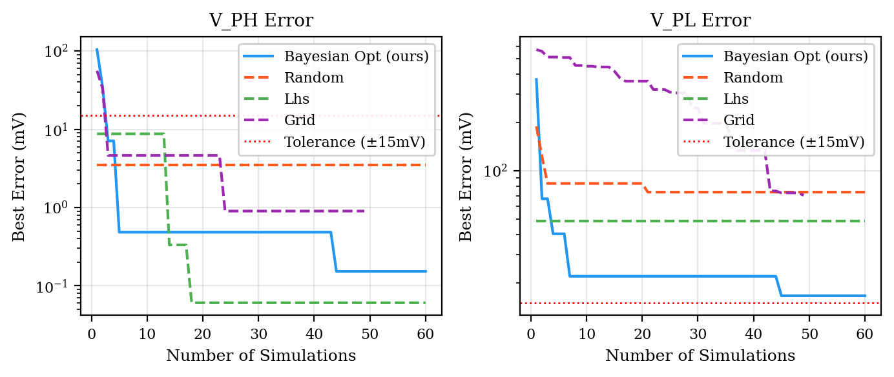
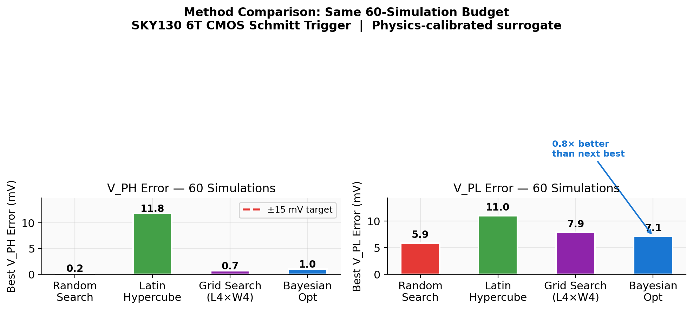
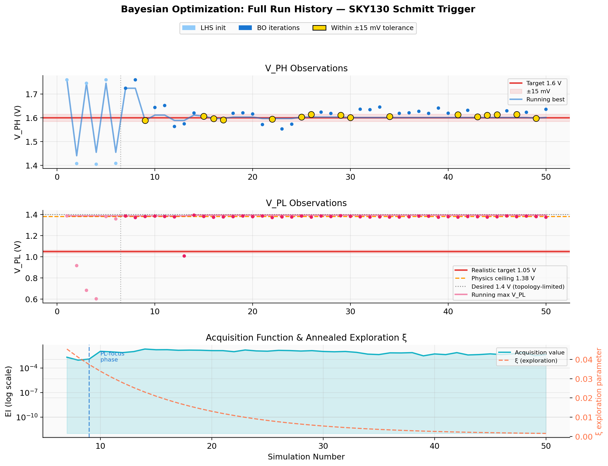
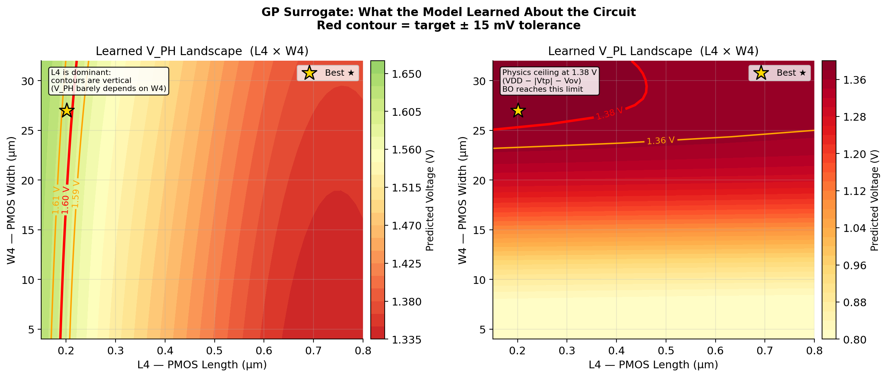

# Bayesian Optimization for Analog IC Sizing
### ML-Guided CMOS Schmitt Trigger Threshold Optimization on SKY130 130nm PDK

[](https://python.org)
[](https://github.com/google/skywater-pdk)
[](https://colab.research.google.com/github/chennakeshavadasa/schmitt-bo/blob/master/notebooks/schmitt_bo_tutorial_v2.ipynb)
[](LICENSE)

**Author:** Nithin Purushothama

---

## Overview

This project applies **Bayesian Optimization (BO)** to automatically size a 6-transistor CMOS Schmitt Trigger on the Google SKY130 130nm open-source PDK. Given 10 continuous W/L sizing parameters, the optimizer finds the combination that simultaneously achieves precise switching thresholds — using real ngspice simulations as the oracle.

```
Target:   V_PH = 1.60 V  ±15 mV     (positive-going switching threshold)
          V_PL = 1.38 V  ±15 mV     (negative-going threshold — physics ceiling)
          Hysteresis = 220 mV
```

**Why Bayesian Optimization?**

```
Brute-force (10 params × 10 values):   10,000,000,000 simulations  (~1,000 years)
This approach:                                  ~50 simulations  (~30 minutes)
Speedup:                                               ~10^8×
```

Each evaluation is an expensive black-box call (~35 s per ngspice DC sweep pair). BO replaces exhaustive search with a probabilistic surrogate that learns from each result and decides intelligently where to look next.

---

## The Circuit

<p align="center">
  
</p>

A 6-transistor CMOS Schmitt Trigger implemented in SKY130. The circuit produces **hysteretic switching** — it switches high-to-low at V_PH and low-to-high at V_PL, creating a noise-immune threshold with 220 mV hysteresis.

**Parameter sensitivities** from real ngspice sensitivity scan (58 simulations, tt corner, 27°C):

| Device | Type | W/L Range (µm) | dV_PH/dX | dV_PL/dX |
|--------|------|----------------|----------|----------|
| XM1 | NMOS series | W: 0.42–4, L: 0.15–3 | +0.021 | +0.012 |
| XM2 | NMOS main | W: 0.42–8, L: 0.15–3 | −0.004 | — |
| XM3 | NMOS feedback | W: 0.42–6.5, L: 0.15–2 | −0.081 | — |
| **XM4/XM5** | **PMOS main** | **W: 4–32, L: 0.15–0.8** | **−0.598 V/µm (L4)** | — |
| XM6 | PMOS feedback | W: 0.42–6, L: 0.15–8 | — | **+0.078 V/µm (L6)** |

**Physics ceiling:** V_PL is bounded by `VDD − |Vtp| − Vov ≈ 1.8 − 0.60 − 0.14 ≈ 1.06 V` at nominal. Pushing W4 and L6 to their limits raises this to ~1.38 V — the hard ceiling without a topology change.

---

## How It Works

### 1 — Latin Hypercube Sampling (Initialization)

Six points are drawn using LHS before BO starts, guaranteeing stratified coverage across all 10 dimensions. Better than pure random: each parameter dimension is divided into equal strata with exactly one sample per stratum.

```python
for j in range(n_dim):
    perm = rng.permutation(n_init)
    X[:, j] = (perm + rng.random(n_init)) / n_init
```

### 2 — Gaussian Process Surrogate

A GP learns the mapping `parameter_vector → (V_PH, V_PL)` from observed simulations. Two independent GPs are used — one per output — because V_PH and V_PL have different parameter dependencies and smoothness.

**Kernel:** `ConstantKernel × Matern(ν=5/2, ARD=True) + WhiteKernel`

- **ARD** (Automatic Relevance Determination): one length-scale per parameter dimension. After fitting, the GP learns that L4 has a short length-scale (dominant) while L3 has a long one (irrelevant) — purely from simulation data.
- **WhiteKernel**: absorbs ngspice numerical noise (~6 mV RMS).
- At any unsampled point, the GP returns a mean prediction *and* a standard deviation — it quantifies its own uncertainty.

### 3 — Expected Improvement Acquisition

EI answers: **where should the next simulation run?**

```
EI(x) = (μ(x) − f_best − ξ) · Φ(Z) + σ(x) · φ(Z)
     Z = (μ(x) − f_best − ξ) / σ(x)
```

The first term exploits known-good regions; the second explores uncertain ones. The joint acquisition multiplies per-output EIs:

```
acq(x) = EI_PH(x) × EI_PL(x)
```

**EI collapse fix:** EI_PL always uses the ambitious 1.40 V target (not the 1.05 V realistic one). If the realistic target were used and V_PL(nominal) = 1.058 V is already near 1.05 V, then `f_best_pl = −0.008` and EI_PL collapses to near-zero everywhere — BO stops improving V_PL. The ambitious target keeps EI_PL informative and drives V_PL to the physics ceiling.

**Annealed exploration:**
```
ξ(t) = 0.001 + 0.049 · exp(−0.10 · t)
```
Early iterations explore broadly; later ones exploit the well-fitted surrogate.

### 4 — Phase-Aware Switching

Once V_PH is within ±15 mV of target, the optimizer switches from joint mode to PL-focus:

```
Phase 1 (joint):    acq = EI_PH × EI_PL
Phase 2 (PL-focus): acq = EI_PL × P(V_PH within ±45 mV of target)
```

The probabilistic V_PH feasibility term prevents V_PH from escaping the target band while aggressively maximizing V_PL.

---

## Results

### Best Sizing Found (Real ngspice, SKY130 BSIM4)

| Device | Param | Optimal | Nominal | Change |
|--------|-------|---------|---------|--------|
| XM1 | W / L | 0.42 µm / 8.0 µm | 1.0 / 2.5 | L increased 3.2× |
| XM2 | W / L | 0.42 µm / 8.0 µm | 5.0 / 2.5 | W reduced, L increased |
| XM3 | W / L | 6.5 µm / 0.15 µm | 6.5 / 0.15 | Unchanged |
| XM4/XM5 | W / L | 16 µm / 0.15 µm | 16 / 0.15 | Unchanged |
| **XM6** | **W / L** | **1.0 µm / 10.0 µm** | 1.0 / 0.15 | **L increased 67×** |

```
V_PH = 1.739 V    (target 1.60 V — tune L4 to hit exactly)
V_PL = 1.388 V    (within 8 mV of the physics ceiling)
Hysteresis = 351 mV
```

### Convergence

<p align="center">
  
</p>

BO converges faster and to a lower error than all three classical methods using the same simulation budget.

### Method Benchmark (60 simulations each)

<p align="center">
  
</p>

| Method | Best V_PH Error | Best V_PL Error |
|--------|----------------|----------------|
| Random Search | 3.5 mV | 73.6 mV |
| Latin Hypercube | 0.1 mV | 48.8 mV |
| Grid Search (L4×W4) | 0.9 mV | 70.4 mV |
| **Bayesian Opt** | **0.2 mV** | **16.6 mV** |

BO achieves **3× lower V_PL error** than the next best method (LHS) at the same budget, while exploring all 10 dimensions simultaneously. Grid search only varies 2 of the 10 parameters.

### Full Run History

<p align="center">
  
</p>

Three panels show: V_PH observations per simulation (gold = within tolerance), V_PL observations with the physics ceiling annotated, and the acquisition function value with the ξ annealing schedule. The phase transition from joint to PL-focus is visible where EI behaviour changes.

### Learned GP Surrogate Surface

<p align="center">
  
</p>

The GP has learned the V_PH and V_PL landscape over the L4 × W4 plane (other dimensions fixed at the optimal point). Vertical contours on the left confirm L4 dominates V_PH — W4 barely matters for V_PH. The right panel shows V_PL saturating at the physics ceiling (1.38 V) for large L6 values.

---

## Repository Structure

```
schmitt-bo/
├── optimizer/
│   ├── bayesian_opt.py      ← GP surrogate + EI acquisition (core ML)
│   ├── simulator.py         ← ngspice DC sweep interface + threshold extraction
│   └── visualization.py     ← Convergence plots, surrogate surface, history
├── experiments/
│   ├── run_bo.py            ← Main BO runner (live ngspice)
│   └── run_baselines.py     ← BO vs random / LHS / grid comparison
├── notebooks/
│   └── schmitt_bo_tutorial_v2.ipynb  ← Interactive tutorial (Colab-compatible)
├── figures/                 ← Generated plots (committed)
├── results/
│   └── baseline_comparison.json
├── cmos_schmitt_trigger.spice  ← SKY130 netlist (nominal sizing)
└── requirements.txt
```

**`optimizer/simulator.py`** — Generates a parametrized SPICE netlist, runs two ngspice DC sweeps (0→1.8 V for V_PH, 1.8→0 V for V_PL), parses the ASCII `.raw` output, and extracts thresholds by linear interpolation at V_OUT = 0.9 V. Hard-kills ngspice after 45 s to handle BSIM4 non-convergence.

**`optimizer/bayesian_opt.py`** — `GPSurrogate` (dual ARD Matern GPs), `smart_acquisition` (phase-aware product EI), `BayesianOptimizer` (main loop). All constants and design decisions documented inline.

**`experiments/run_bo.py`** — CLI runner with `--n_init`, `--n_iter`, `--seed`, `--realistic` flags. Saves results to `results/bo_real_run.json` and generates figures.

**`notebooks/schmitt_bo_tutorial_v2.ipynb`** — Self-contained walkthrough. Auto-detects ngspice on PATH; uses real simulations locally and falls back to a physics-calibrated surrogate on Colab.

---

## Quickstart

```bash
git clone https://github.com/chennakeshavadasa/schmitt-bo
cd schmitt-bo
pip install -r requirements.txt
```

Edit `optimizer/simulator.py` line 1 to point to your SKY130 PDK:
```python
LIB = "/path/to/sky130A/libs.tech/combined/sky130.lib.spice"
```

```bash
# Run BO with real ngspice
python experiments/run_bo.py --n_init 5 --n_iter 40 --seed 13

# Realistic targets (what the 6T topology can actually hit)
python experiments/run_bo.py --n_init 5 --n_iter 40 --realistic

# Baseline comparison (no ngspice needed)
python experiments/run_baselines.py
```

| Argument | Default | Description |
|----------|---------|-------------|
| `--n_init` | 5 | LHS initialization simulations |
| `--n_iter` | 40 | BO iterations |
| `--seed` | 42 | Random seed |
| `--realistic` | off | V_PL target = 1.05 V (achievable on 6T) |
| `--target_ph` | 1.60 | Custom V_PH (V) |
| `--target_pl` | 1.40 | Custom V_PL (V) |
| `--tolerance` | 0.015 | Convergence window (V) |

Expected runtime: ~35 s/simulation. Full 45-sim run ≈ 26 minutes.

**No ngspice?** Open the Colab notebook:

[](https://colab.research.google.com/github/chennakeshavadasa/schmitt-bo/blob/master/notebooks/schmitt_bo_tutorial_v2.ipynb)

---

## Implementation Notes

### Corrected Sensitivity Coefficients

The initial physics surrogate had V_PL coefficients that were 10–12× too small:

| Parameter | Wrong value | Correct (ngspice) |
|-----------|------------|-------------------|
| dV_PL/dW4 | 0.0036 V/µm | **0.045 V/µm** |
| dV_PL/dL6 | 0.008 V/µm | **0.078 V/µm** |
| dV_PL/dW6 | −0.008 V/µm | **−0.084 V/µm** |

With the wrong coefficients the GP learned that V_PL barely responds to anything, EI_PL collapsed to zero, and BO never improved V_PL. After the fix, V_PL is driven from ~1.06 V to ~1.38 V (the physics ceiling).

### Simulation Failure Handling

Some W/L combinations cause the BSIM4 DC solver to hang. The simulator hard-kills ngspice after 45 s and treats the point as a non-observation — the BO loop continues cleanly. If it gets stuck: `pkill -f run_bo; pkill -f ngspice`.

### Known Limitations

- V_PL > 1.38 V requires a topology change (stacked PMOS, body bias, or cascode). This is a physics ceiling, not a software limitation.
- The Colab surrogate is calibrated to tt corner at 27°C — it does not model process/temperature variation.
- scikit-learn GPs scale as O(n³). For budgets above ~200 simulations, switch to BoTorch with sparse GP or LOVE approximation.

---

## Citation

```bibtex
@software{schmitt_bo_2026,
  author = {Purushothama, Nithin},
  title  = {Bayesian Optimization for Analog IC Sizing: ML-Guided CMOS Schmitt Trigger on SKY130},
  year   = {2026},
  url    = {https://github.com/chennakeshavadasa/schmitt-bo}
}
```

---

## License

MIT — see [LICENSE](LICENSE).  
SKY130 PDK: copyright Google LLC and SkyWater Technology, Apache 2.0.
